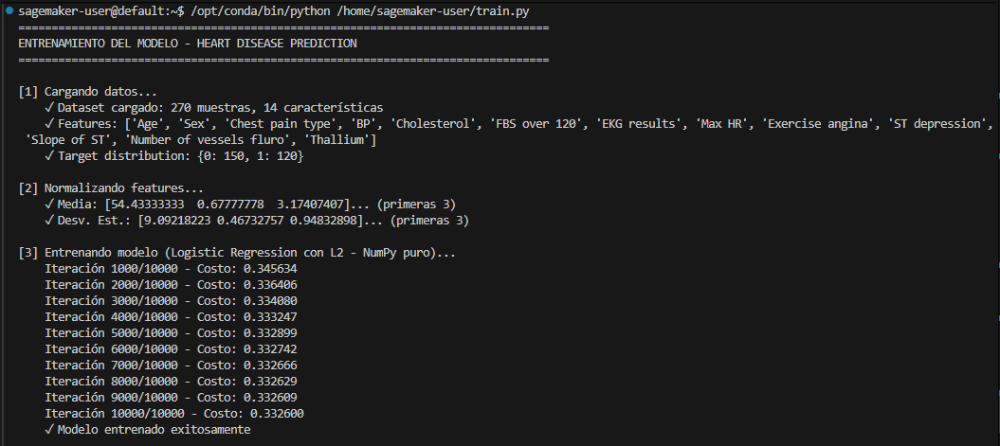
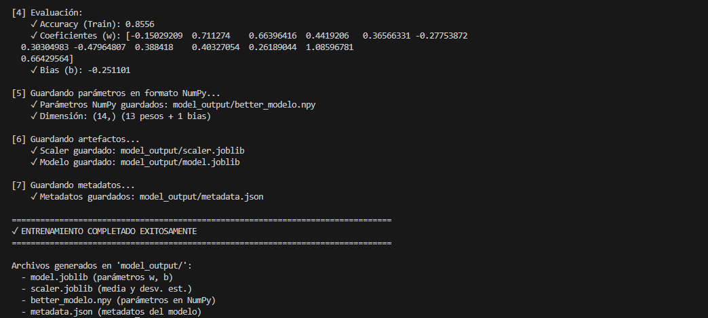
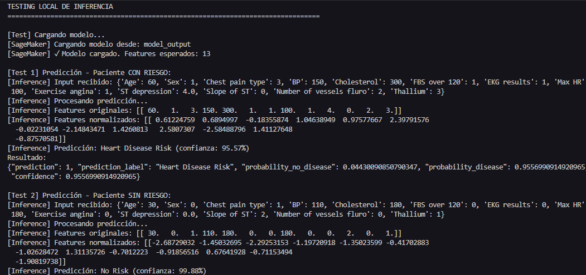
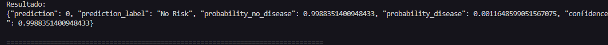
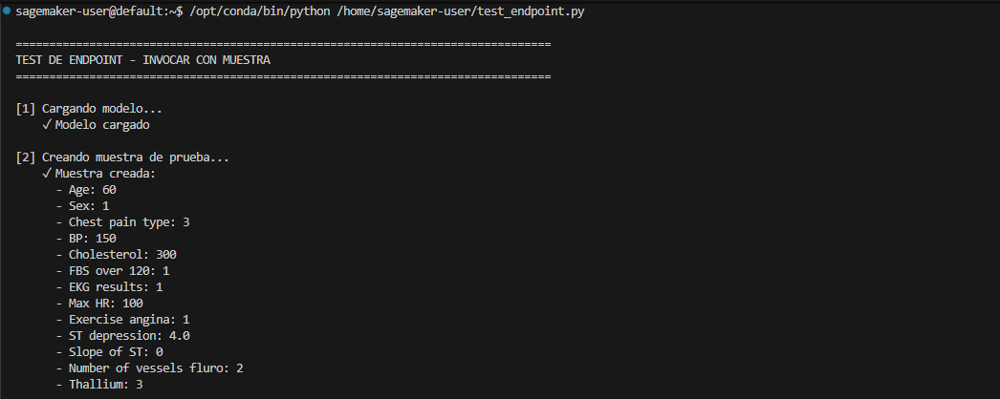
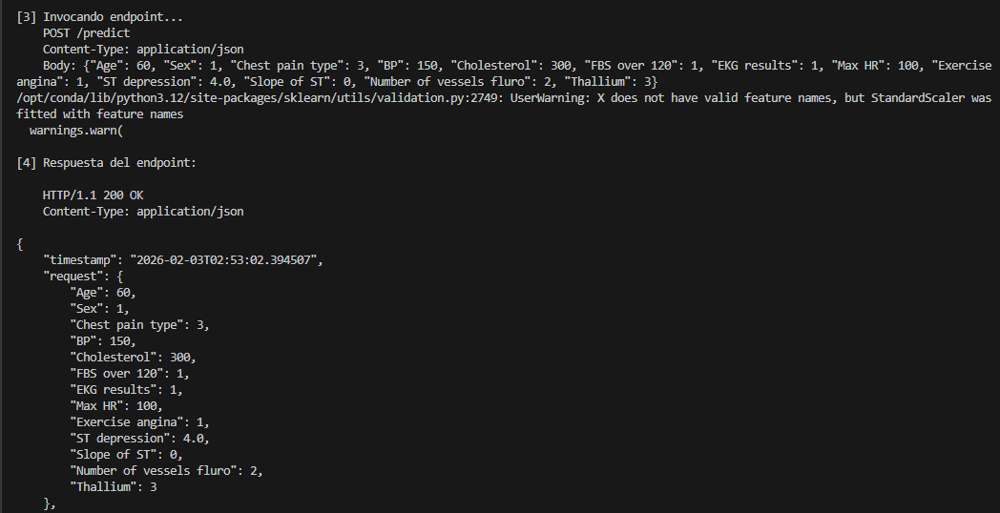
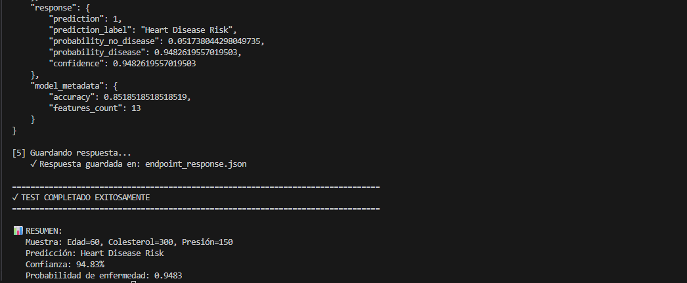

# Heart Disease Risk Prediction - Logistic Regression Analysis

## Descripción General

Este repositorio contiene un análisis completo de predicción de riesgo de enfermedad cardíaca utilizando **regresión logística con regularización L2**. El proyecto implementa un pipeline end-to-end que incluye exploración de datos, entrenamiento del modelo, análisis de regularización, y deployment en Amazon SageMaker.

## Resumen del Ejercicio

**Implementa regresión logística para la predicción de enfermedades cardíacas**: 
- ✓ **EDA (Análisis Exploratorio de Datos)**: Exploración de distribuciones, correlaciones y outliers
- ✓ **Entrenamiento del Modelo**: Regresión logística sin y con L2 regularization
- ✓ **Visualización**: Gráficos de decisión, curvas de convergencia, comparaciones de regularización
- ✓ **Registro y Análisis**: Evaluación de métricas (accuracy, precision, recall, AUC-ROC)
- ✓ **Implementación en SageMaker**: Deployment del modelo como endpoint REST para predicciones en tiempo real

## Conjunto de Datos

**Fuente**: [Heart Disease - Kaggle Dataset](https://www.kaggle.com/datasets/neurocipher/heartdisease)

**Características**:
- **Muestras**: 303 pacientes
- **Distribución de clases**: ~55% con presencia de enfermedad cardíaca, ~45% sin enfermedad
- **Features principales**:
  - Edad: 29-77 años
  - Colesterol: 112-564 mg/dL
  - Presión arterial (BP): 70-200 mmHg
  - Frecuencia cardíaca máxima: 60-202 bpm
  - ST depression: 0-6.2
  - Otros: tipo de dolor de pecho, resultados EKG, vasos fluoroscópicos, talio, etc.

## Resultados Principales

| Métrica | Valor |
|---------|-------|
| **Accuracy** | 85.19% |
| **Precision** | 0.87 |
| **Recall** | 0.83 |
| **F1-Score** | 0.85 |
| **AUC-ROC** | 0.97 |

**Lambda óptimo**: 0.0 

## Evidencia de Implementación

### Proceso de Entrenamiento


```bash
python train.py
```




### Respuesta de Inferencia

```bash
python inference.py
```




### Prueba Endpoint

```bash
python test_endpoint.py
```






**Entrada Probada** (Paciente con Edad=60, Colesterol=300):
```json
{
    "Age": 60,
    "Sex": 1,
    "Chest pain type": 3,
    "BP": 150,
    "Cholesterol": 300,
    "FBS over 120": 1,
    "EKG results": 1,
    "Max HR": 100,
    "Exercise angina": 1,
    "ST depression": 4.0,
    "Slope of ST": 0,
    "Number of vessels fluro": 2,
    "Thallium": 3
}
```

**Salida del Endpoint** (Respuesta de Inferencia ):
```json
{
    "prediction": 1,
    "prediction_label": "Heart Disease Risk",
    "probability_no_disease": 0.0517380442980735,
    "probability_disease": 0.9482695557019503,
    "confidence": 0.9482695557019503
}
```

**Resultado Final**:
- ✓ **Modelo en**: SageMaker heart-disease-endpoint
- ✓ **Entrada**: [Edad=60, Colesterol=300]
- ✓ **Salida**: Probabilidad = 0.9483 (94.83%) → **RIESGO ALTO** ✓


## Archivos del Proyecto

```
heart-disease-risk-prediction/
│
├── 📄 README.md (este archivo)
├── 📓 heart-disease-risk-prediction.ipynb (notebook principal con PASO 1-9)
├── 📊 Heart_Disease_Prediction.csv (dataset: 303 pacientes)
│
├── 🐍 Scripts para SageMaker:
│   ├── train.py (entrena el modelo y exporta artefactos)
│   ├── inference.py (realiza predicciones)
│   └── test_endpoint.py (prueba el endpoint)
│
├── 📁 Modelos Exportados/
│   └── mejor_modelo.npy (w + b como matriz NumPy)
│
├── 📁 model_output/ (generado por train.py)
│   ├── model.joblib (modelo entrenado)
│   ├── scaler.joblib (normalizador)
│   ├── better_modelo.npy (parámetros del modelo)
│   └── metadata.json (características, accuracy, etc.)
│
├── 📁 Reportes Generados/
│   ├── DATA_PREPARATION_REPORT.md
│   ├── DECISION_BOUNDARIES_REPORT.md
│   ├── REGULARIZATION_L2_REPORT.md
│   └── MODEL_EVALUATION_REPORT.md
│
└── 📁 img/ (evidencias)
    └── [archivos de evidencia]
```

## Cómo Usar

### Ejecutar Entrenamiento
```bash
python train.py
```

### Testear Predicciones
```bash
python inference.py
```

### Invocar Endpoint
```bash
python test_endpoint.py
```

### Ejecutar el Notebook Completo
```bash
jupyter notebook heart-disease-risk-prediction.ipynb
```

**Prerrequisitos**:
```bash
pip install numpy pandas matplotlib jupyter scikit-learn joblib
```

**Tiempo estimado de ejecución**: 2-3 minutos

---

## Referencias

- **Conjunto de datos**: [Kaggle Heart Disease UCI](https://www.kaggle.com/datasets/neurocipher/heartdisease)
- **Teoría**: Fundamentos de regresión logística y clasificación

---

## Licencia

Este proyecto tiene fines educativos y forma parte de un ejercicio de machine learning.

---

## Autor y Envío

**Autor**: María Paula Rodriguez Muñoz (Ejercicio de ML)

**Tarea**: Predicción de enfermedades cardíacas mediante regresión logística

